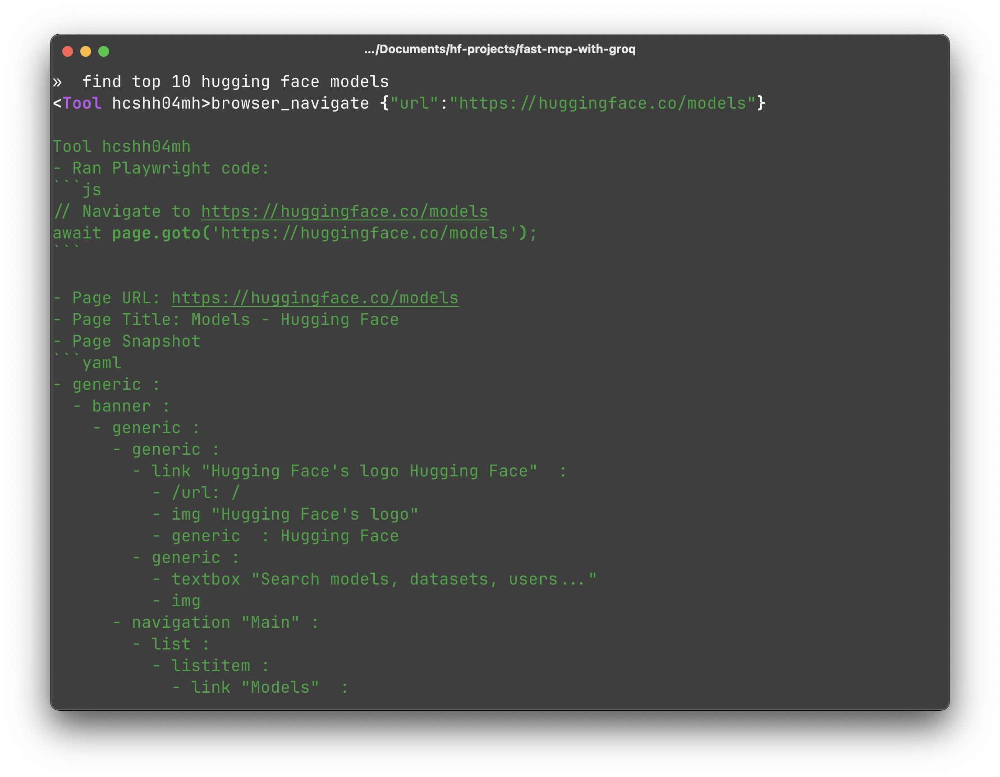

# Blazingly Fast Agents with MCP and *Groq* 💥

Build powerful AI applications with Hugging Face's pre-trained models and Groq's lightning-fast inference. The Model Control Protocol (MCP) seamlessly connects these tools, enabling you to create sophisticated AI workflows with minimal effort.

In this guide, we'll explore MCP and demonstrate how to build blazingly fast AI agents using Groq. We'll use Hugging Face's lightweight MCP clients:

1. `@huggingface/tiny-agents` (TypeScript)
2. `huggingface_hub[mcp]` (Python)

The key to building effective AI agents lies in their tools. MCP provides a standardized interface for tool interaction, making it simple to create powerful agents. Let's dive in by creating a web-savvy agent that can browse and search the internet for you.

Step 1: Define the Agent

Both the JS and Python Tiny agent clients are meant to be quite easy to play and experiment with. They expect a transparent `agent.json` which includes the details of which LLM should be used and what tools it should have access to.

Let's define our agent using Llama 3.3 70B Instruct as the LLM and connect it to a Playwright MCP server for browser automation.

```json
{
	"model": "Qwen/Qwen3-32B",
	"provider": "groq",
	"servers": [
		{
			"type": "stdio",
			"config": {
				"command": "npx",
				"args": ["@playwright/mcp@latest"]
			}
		}
	]
}
```

Optionally, we can define a System Prompt that helps steer the LLM

```markdown
You are an agent - please keep going until the user’s query is completely resolved, before ending your turn and yielding back to the user. Only terminate your turn when you are sure that the problem is solved, or if you need more info from the user to solve the problem.

If you are not sure about anything pertaining to the user’s request, use your tools to read files and gather the relevant information: do NOT guess or make up an answer.

You MUST plan extensively before each function call, and reflect extensively on the outcomes of the previous function calls. DO NOT do this entire process by making function calls only, as this can impair your ability to solve the problem and think insightfully.

Help the User with their task.
```

That's it, let's take it out for a spin.

Step 2: Run the agent.

To run the agent in Python, we'll simply install tiny-agents package part of the `huggingface_hub` library.

```bash
pip install "huggingface_hub[mcp]>=0.32.0"
```

Followed by running our agent:

```bash
tiny-agents run ./browser-agent
```


You can do exactly the same thing with our JavaScript client as well

```bash
npx @huggingface/tiny-agents run ./browser-agent
```



Voila, you now have a capable browser agent with you!

Let's take it up a notch and give more creative freedom to our AI Agent, cue, Hugging Face MCP Server. The Hugging Face MCP server allows you to not only interact with the HF Hub but also with 1000s of AI spaces on [hf.co/spaces](https://hf.co/spaces). 

Let's get it set up!

Step 1: Head over to [hf.co/mcp](https://hf.co/mcp) and add the spaces/ demo that you want to be able to play with


For example, I've added the following space 

Next, let's update our `agent.json`:

```json
{
	"model": "Qwen/Qwen3-32B",
	"provider": "groq",
	"servers": [
		{
			"type": "http",
			"config": {
				"url": "https://huggingface.co/mcp",
                "headers": {
                    "Authorization": "Bearer <HF_TOKEN>"
                  }
			}
		}
	]
}
```

Step 2: Run with Tiny agents

```bash
tiny-agents run ./hf-mcp-server
```

You can do exactly the same thing with our JavaScript client as well

```bash
npx @huggingface/tiny-agents run ./hf-mcp-server
```


That's it! What would you build next with it?